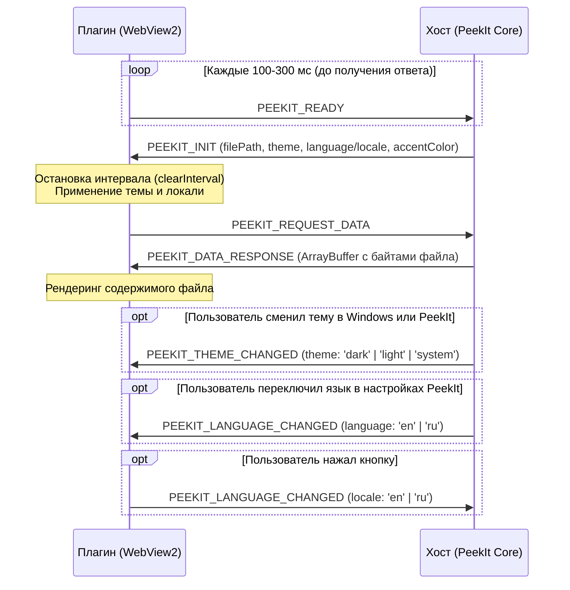

# Руководство по разработке и упаковке плагинов для PeekIt (.pkit)

Официальное подробное руководство разработчика плагинов для **[PeekIt](https://github.com/kobaltgit/peekit)** — инструмента мгновенного предварительного просмотра файлов по клавише **Space (Пробел)** в Windows 10 & 11.

Здесь описана архитектура веб-плагинов, двусторонний протокол взаимодействия по IPC, правила оформления манифеста, стандарты тем и локализации, канонический порядок выполнения скриптов (Zero-TDZ), автоматизированное предрелизное тестирование (`npm test`) и сборка пакетов формата **`.pkit`**.

---

## Содержание

1. [Архитектурная концепция](#1-архитектурная-концепция)
2. [Структура и анатомия плагина](#2-структура-и-анатомия-плагина)
3. [Манифест плагина (manifest.json)](#3-манифест-плагина-manifestjson)
4. [Протокол взаимодействия (PeekIt IPC Protocol)](#4-протокол-взаимодействия-peekit-ipc-protocol)
5. [Канонический порядок выполнения скрипта (Zero-TDZ)](#5-канонический-порядок-выполнения-скрипта-zero-tdz)
6. [Система тем оформления (Theme Engine)](#6-система-тем-оформления-theme-engine)
7. [Глубокая интернационализация (Deep Visual I18N)](#7-глубокая-интернационализация-deep-visual-i18n)
8. [Безопасная интеграция сторонних библиотек (Vendor Bundling)](#8-безопасная-интеграция-сторонних-библиотек-vendor-bundling)
9. [Автоматизированное предрелизное тестирование (npm test)](#9-автоматизированное-предрелизное-тестирование-npm-test)
10. [Сборка пакета .pkit и публикация](#10-сборка-пакета-pkit-и-публикация)
11. [Тестирование в установленном приложении PeekIt](#11-тестирование-в-установленном-приложении-peekit)
12. [Предрелизный чек-лист разработчика](#12-предрелизный-чек-лист-разработчика)

---

## 1. Архитектурная концепция

Плагины в PeekIt — это **легковесные автономные веб-приложения (HTML5 + CSS3 + Vanilla JS / WebGL / WASM)**, которые исполняются внутри изолированного контейнера WebView2 (`<iframe sandbox="allow-scripts">`).

### Ключевые преимущества:
* **0 МБ в фоне (Zero Idle Memory):** Плагин активируется только в момент нажатия Пробела на поддерживаемом файле и мгновенно выгружается из памяти при закрытии окна.
* **Безопасность песочницы:** Сбой или зависание рендера в плагине никогда не приводят к падению хост-приложения PeekIt. У плагина нет прямого доступа к файловой системе ОС, реестру и сети.
* **100% Автономность (Strict Offline):** Все плагины полностью самодостаточны и обязаны работать без подключения к сети Интернет. Любые внешние HTTP/HTTPS запросы заблокированы.
* **Нулевая компиляция:** Для разработки не требуются компиляторы C++, Rust или C#. Достаточно стандартного веб-стека.

---

## 2. Структура и анатомия плагина

Каждый плагин располагается в собственной поддиректории каталога `plugins/` (например, `plugins/peekit-plugin-3d/`):

```text
peekit-plugin-<slug>/
├── manifest.json         # Паспорт плагина (метаданные, расширения, версия)
├── index.html            # Единая точка входа (UI + логика + инлайненные стили и библиотеки)
└── icon.svg              # (Опционально) Векторная иконка плагина
```

> [!IMPORTANT]
> **Правило полной автономности (Zero External Requests):**  
> Плагин **не имеет права** загружать скрипты, шрифты или стили с внешних CDN (`<script src="https://cdn...">` строго запрещены!). Все вендорные библиотеки должны быть скачаны локально и инлайнены прямо в `index.html`. Это обеспечивает мгновенный холодный запуск (< 30 мс) и независимость от сетевого окружения.

---

## 3. Манифест плагина (`manifest.json`)

Манифест описывает плагин для сканера и маркетплейса PeekIt.

```json
{
  "$schema": "https://raw.githubusercontent.com/kobaltgit/peekit-plugins/main/plugin-schema.json",
  "id": "com.peekit.psd-viewer",
  "name": "Adobe Photoshop Viewer",
  "version": "1.1.0",
  "author": "Kobalt",
  "description": "Просмотр PSD-файлов: композитный рендер, дерево слоев, метаданные и прозрачность",
  "supportedExtensions": [".psd"],
  "category": "Graphics",
  "entry": "index.html",
  "default_view": "window",
  "icon": "icon.svg",
  "default_dimensions": {
    "width": 960,
    "height": 680
  },
  "min_peekit_version": "1.0.0"
}
```

### Спецификация полей:
| Поле | Тип | Описание | Обязательное |
| :--- | :--- | :--- | :---: |
| `id` | `string` | Идентификатор в обратной доменной нотации (`com.peekit.<slug>` или `com.<author>.<slug>`) | **Да** |
| `name` | `string` | Человекочитаемое имя плагина (отображается в заголовке и каталоге) | **Да** |
| `version` | `string` | Строгая SemVer-версия (`1.0.0`, `1.1.0`). При любых изменениях версия должна увеличиваться | **Да** |
| `entry` | `string` | Точка входа в плагин (всегда `index.html`) | **Да** |
| `supportedExtensions` | `string[]` | Массив расширений файлов в нижнем регистре с точкой: `[".psd"]`, `[".ai", ".eps"]` | **Да** |
| `category` | `string` | Категория плагина: `Graphics`, `Office`, `Media`, `Code`, `Archive`, `Utilities` | **Да** |
| `author` | `string` | Имя автора или организации | Нет |
| `description` | `string` | Краткое описание возможностей (до 150 символов) | Нет |
| `default_dimensions` | `object` | Рекомендуемые размеры окна при первом открытии (`width`, `height` в px) | Нет |

---

## 4. Протокол взаимодействия (PeekIt IPC Protocol)

Плагин взаимодействует с хост-приложением PeekIt через двусторонние асинхронные сообщения `window.postMessage`.

### Диаграмма рукопожатия и передачи данных



> [!CAUTION]
> **КРИТИЧЕСКОЕ ПРАВИЛО: Запрет отправки `PEEKIT_READY` в `PEEKIT_DATA_RESPONSE`**  
> Никогда не вызывайте отправку `PEEKIT_READY` внутри обработчика `PEEKIT_DATA_RESPONSE`!  
> Хост PeekIt интерпретирует сигнал `PEEKIT_READY` как факт перезагрузки фрейма и начинает процедуру инициализации заново (`PEEKIT_INIT`), что приводит к бесконечному зацикливанию рендера и мерцанию окна.

---

## 5. Канонический порядок выполнения скрипта (Zero-TDZ)

В JavaScript переменные, объявленные через `let` и `const`, находятся в Temporal Dead Zone (TDZ) до строки своего присвоения. Любая ошибка в начале скрипта приводит к тому, что выполнение аварийно прерывается, и плагин **никогда не отправит сигнал `PEEKIT_READY`** хосту, зависнув на экране загрузки.

Чтобы гарантировать 100% стабильность, код внутри основного `<script>` должен следовать **каноническому порядку из 7 шагов**:

```javascript
(function () {
  'use strict';

  // 1. Инициализация состояния
  let currentTheme = 'dark';
  let currentLocale = localStorage.getItem('peekit_myplugin_lang') || 
                      (navigator.language && navigator.language.startsWith('ru') ? 'ru' : 'en');
  let currentData = null;
  let readyInterval = null;
  let isSystemTheme = false;

  // 2. Движок темы (Theme Engine)
  function applyTheme(themeInput) {
    let isDark = true;
    let accentColor = null;

    if (themeInput && typeof themeInput === 'object') {
      if (typeof themeInput.isDark === 'boolean') isDark = themeInput.isDark;
      else if (typeof themeInput.theme === 'string') {
        const t = themeInput.theme.toLowerCase();
        if (t === 'system') {
          isSystemTheme = true;
          isDark = window.matchMedia && window.matchMedia('(prefers-color-scheme: dark)').matches;
        } else {
          isSystemTheme = false;
          isDark = t !== 'light';
        }
      }
      accentColor = themeInput.accentColor || themeInput.settings?.accentColor;
    } else if (typeof themeInput === 'string') {
      const t = themeInput.toLowerCase();
      if (t === 'system') {
        isSystemTheme = true;
        isDark = window.matchMedia && window.matchMedia('(prefers-color-scheme: dark)').matches;
      } else {
        isSystemTheme = false;
        isDark = t !== 'light';
      }
    }

    document.documentElement.setAttribute('data-theme', isDark ? 'dark' : 'light');
    document.body.classList.toggle('dark-theme', isDark);
    document.body.classList.toggle('light-theme', !isDark);
    if (accentColor) {
      document.documentElement.style.setProperty('--accent', accentColor);
    }
  }

  if (window.matchMedia) {
    window.matchMedia('(prefers-color-scheme: dark)').addEventListener('change', (e) => {
      if (isSystemTheme) applyTheme(e.matches ? 'dark' : 'light');
    });
  }

  // 3. Движок локализации (Localization Engine)
  const I18N = {
    ru: {
      loading: 'Загрузка...',
      layers: 'Слои',
      langToggleTitle: 'Сменить язык (EN / RU)'
    },
    en: {
      loading: 'Loading...',
      layers: 'Layers',
      langToggleTitle: 'Switch Language (EN / RU)'
    }
  };

  function t(key) {
    return (I18N[currentLocale] || I18N.en)[key] || key;
  }

  function applyLocale(locale) {
    if (!locale) return;
    currentLocale = locale.slice(0, 2).toLowerCase();
    if (!I18N[currentLocale]) currentLocale = 'en';

    localStorage.setItem('peekit_myplugin_lang', currentLocale);
    document.documentElement.setAttribute('lang', currentLocale);

    const btnLang = document.getElementById('btnToggleLang');
    if (btnLang) {
      btnLang.textContent = currentLocale.toUpperCase();
      btnLang.title = t('langToggleTitle');
    }

    document.querySelectorAll('[data-i18n]').forEach((el) => {
      const key = el.getAttribute('data-i18n');
      if (key && t(key)) el.textContent = t(key);
    });

    // Перерисовка видимых бейджей и данных
    if (typeof renderContent === 'function' && currentData) {
      renderContent(currentData);
    }
  }

  // 4. Слушатель входящих IPC сообщений хоста
  window.addEventListener('message', (event) => {
    const msg = event.data;
    if (!msg || typeof msg !== 'object') return;

    switch (msg.type) {
      case 'PEEKIT_INIT': {
        // Обязательно гасим таймер рукопожатия
        if (readyInterval) {
          clearInterval(readyInterval);
          readyInterval = null;
        }

        const payload = msg.payload || msg;

        // Каскадное извлечение языка
        const langVal = payload.language || payload.locale || payload.lang || 
                        payload.settings?.language || payload.settings?.locale;
        if (langVal) applyLocale(langVal);
        else applyLocale(currentLocale);

        // Применение темы
        applyTheme(payload);

        // Запрос данных
        window.parent.postMessage({ type: 'PEEKIT_REQUEST_DATA' }, '*');
        break;
      }

      case 'PEEKIT_THEME_CHANGED': {
        applyTheme(msg.payload || msg);
        break;
      }

      case 'PEEKIT_LANGUAGE_CHANGED':
      case 'PEEKIT_LOCALE_CHANGED': {
        const payload = msg.payload || msg;
        const langVal = payload.language || payload.locale || payload.lang || 
                        (typeof payload === 'string' ? payload : null);
        if (langVal) applyLocale(langVal);
        break;
      }

      case 'PEEKIT_DATA_RESPONSE': {
        const rawData = msg.payload?.data !== undefined ? msg.payload.data : msg.payload;
        if (msg.payload?.error || !rawData) {
          showError('Не удалось загрузить файл: ' + (msg.payload?.error || 'Нет данных'));
          return;
        }

        let buffer = null;
        if (rawData instanceof ArrayBuffer) buffer = rawData;
        else if (ArrayBuffer.isView(rawData)) buffer = rawData.buffer.slice(rawData.byteOffset, rawData.byteOffset + rawData.byteLength);
        else if (Array.isArray(rawData)) buffer = new Uint8Array(rawData).buffer;

        currentData = buffer;
        renderContent(buffer);
        break;
      }
    }
  });

  // 5. Обработчики кликов UI (с двусторонней синхронизацией)
  const btnToggleLang = document.getElementById('btnToggleLang');
  if (btnToggleLang) {
    btnToggleLang.addEventListener('click', () => {
      const nextLocale = currentLocale === 'ru' ? 'en' : 'ru';
      applyLocale(nextLocale);
      // Двусторонний IPC: уведомляем хост PeekIt
      if (window.parent && window.parent !== window) {
        window.parent.postMessage({
          type: 'PEEKIT_LANGUAGE_CHANGED',
          payload: { locale: nextLocale, language: nextLocale }
        }, '*');
      }
    });
  }

  // 6. Первоначальный вызов до прихода IPC
  applyTheme(currentTheme);
  applyLocale(currentLocale);

  // 7. Запуск интервала рукопожатия
  readyInterval = setInterval(() => {
    window.parent.postMessage({ type: 'PEEKIT_READY' }, '*');
  }, 250);
  window.parent.postMessage({ type: 'PEEKIT_READY' }, '*');

  function renderContent(buffer) {
    /* Бизнес-логика рендера */
  }

  function showError(msg) {
    const app = document.getElementById('app');
    if (app) app.innerHTML = `<div class="error-view">${msg}</div>`;
  }
})();
```

---

## 6. Система тем оформления (Theme Engine)

Плагин **обязан** поддерживать три режима темы: светлый (`light`), тёмный (`dark`) и системный (`system`), а также корректно реагировать на переключение темы Windows на лету.

### CSS-структура токенов темы:

```css
/* Тёмная тема по умолчанию */
:root, [data-theme="dark"] {
  --bg-main:       #0d1117;
  --bg-surface:    #161b22;
  --bg-card:       #21262d;
  --bg-card-hover: #30363d;
  --border-color:  rgba(255, 255, 255, 0.12);
  --text-main:     #f0f6fc;
  --text-muted:    #8b949e;
  --accent:        #58a6ff;
}

/* Светлая тема */
[data-theme="light"] {
  --bg-main:       #f6f8fa;
  --bg-surface:    #ffffff;
  --bg-card:       #f3f4f6;
  --bg-card-hover: #e5e7eb;
  --border-color:  rgba(0, 0, 0, 0.12);
  --text-main:     #1f2328;
  --text-muted:    #656d76;
  --accent:        #0969da;
}

body {
  background-color: var(--bg-main);
  color: var(--text-main);
  font-family: -apple-system, BlinkMacSystemFont, "Segoe UI", Roboto, sans-serif;
  margin: 0;
  overflow: hidden;
}
```

> **Правило:** Ни один видимый элемент не должен содержать жестко закодированных hex/rgb-цветов. Все фоны, границы и тексты должны использовать CSS-переменные `var(--...)`.

---

## 7. Глубокая интернационализация (Deep Visual I18N)

Интернационализация должна быть **глубокой и всеобъемлющей**. В плагине не должно оставаться текста на одном языке.

### Стандарты глубокой визуальной локализации:
1. **Вложенные узлы внутри кнопок тулбара:**
   ```html
   <button id="btnLayers" class="btn">
     <span>▦</span> <span id="btnLayersText">Слои</span>
   </button>
   ```
   При переключении языка текст `#btnLayersText` должен явно переводиться: `Слои` ⇄ `Layers`.
2. **Динамические счетчики и бейджи:**
   Строки вида `12 слоёв` ⇄ `12 layers`, `24 страницы` ⇄ `24 pages` должны формироваться динамически с учетом текущего `currentLocale`.
3. **Заголовки панелей и дроверов:**
   Боковые панели и вкладки (например, `Слои (12)` ⇄ `Layers (12)`) должны обновляться при вызове `applyLocale`.
4. **Статус-теги и форматы:**
   Теги превью: `Вектор` ⇄ `Vector`, `Растр` ⇄ `Raster`.
5. **Всплывающие подсказки (tooltip / title):**
   Кнопки масштабирования, вращения, полноэкранного режима должны менять атрибут `title` через `data-i18n-title`.
6. **Кнопка переключения `#btnToggleLang`:**
   Каждый плагин должен иметь в шапке кнопку `#btnToggleLang` (например, `RU` / `EN`), клик по которой не только переключает интерфейс, но и посылает родителю событие `PEEKIT_LANGUAGE_CHANGED`.

---

## 8. Безопасная интеграция сторонних библиотек (Vendor Bundling)

Если плагин использует тяжелые библиотеки (Three.js, Leaflet, PDF.js, ag-psd, sql.js, utif, fflate):

1. **Порядок подключения:** Вендорный скрипт подключается первым, прикладной код плагина — вторым.
2. **Защита глобального окружения:** Вендорный код не должен модифицировать или затирать `window.parent`, `window.postMessage`, `navigator` или стандартные прототипы.
3. **Эмуляция свойств navigator:** Некоторые библиотеки (например, Leaflet) обращаются к `navigator.platform` или `navigator.appVersion`. Убедитесь, что код библиотеки не падает при изолированном окружении WebView2.
4. **WASM и бинарные ассеты:** Файлы `.wasm` должны быть либо инлайнены в формате base64, либо упакованы локально в архив плагина.

---

## 9. Автоматизированное предрелизное тестирование (`npm test`)

Перед любой сборкой и коммитом в репозиторий **обязательно** запускается тестовый комплекс:

```bash
npm test
# или напрямую:
node test_plugins.cjs
```

### Комплекс проверяет все плагины по 6 критериям:

```text
======================================================
       PeekIt Plugins Pre-Production Test Suite        
======================================================

┌─────────┬─────────────────────────┬──────────┬─────────┬────────┬─────────┬──────────┬────────┐
│ (index) │ Plugin                  │ Manifest │ Offline │ Syntax │ Runtime │ I18N Btn │ Status │
├─────────┼─────────────────────────┼──────────┼─────────┼────────┼─────────┼──────────┼────────┤
│ 0       │ 'peekit-plugin-3d'      │ 'PASS'   │ 'PASS'  │ 'PASS' │ 'PASS'  │ 'PASS'   │ 'OK'   │
│ ...     │ ...                     │ ...      │ ...     │ ...    │ ...     │ ...      │ ...    │
│ 19      │ 'peekit-plugin-video'   │ 'PASS'   │ 'PASS'  │ 'PASS' │ 'PASS'  │ 'PASS'   │ 'OK'   │
└─────────┴─────────────────────────┴──────────┴─────────┴────────┴─────────┴──────────┴────────┘

✅ ALL 20 PLUGINS PASSED PRE-PRODUCTION VERIFICATION!
```

1. **Manifest Schema:** Валидация структуры `manifest.json`, формата `id`, SemVer, точки входа и расширений.
2. **Strict Offline & Security:** Сканирование на предмет отсутствия внешних ссылок, CDN, внешних `<iframe>`, удаленных `fetch`/`WebSocket`/`XHR`.
3. **V8 Syntax Compilation (`vm.Script`):** Изолированная компиляция скриптов через движок V8 Node.js. Выявляет синтаксические ошибки, пропущенные скобки и невалидный синтаксис до запуска.
4. **Runtime Lifecycle & Handshake:** Эмуляция изолированного DOM (WebView2 mock). Проверка отправки `PEEKIT_READY`, ответа на `PEEKIT_INIT`, очистки интервала.
5. **Theme Engine:** Эмуляция переключения темы хостом `light` ⇄ `dark` на лету (`PEEKIT_THEME_CHANGED`).
6. **Localization Engine:** Проверка наличия кнопки `#btnToggleLang`, эмуляция клика переключения языка, проверка реакции на `PEEKIT_LANGUAGE_CHANGED`.

> **Критерий допуска:** Сборка пакетов плагина разрешена **только при 100% прохождении тестов (20/20 PASS)**.

---

## 10. Сборка пакета `.pkit` и публикация

Для упаковки плагинов используется утилита [`pack_plugin.cjs`](file:///d:/Projects/active/peekit-plugins/pack_plugin.cjs):

```bash
# Собрать все плагины, обновить реестр registry.json и скопировать на сайт маркетплейса:
npm run pack

# Или упаковать отдельный плагин:
node pack_plugin.cjs plugins/peekit-plugin-psd
```

### Что делает скрипт упаковки:
1. Запускает валидацию структуры плагина и его манифеста.
2. Формирует сжатый архив формата `.pkit` в папке `dist/`.
3. Вычисляет криптографический хеш **SHA-256** для контроля целостности.
4. Обновляет каталог `registry.json` и синхронизирует его с сайтом маркетплейса (`website/assets/registry.json`).
5. Копирует скомпилированные `.pkit` пакеты в директорию веб-дистрибуции (`website/web/plugins/`).

---

## 11. Тестирование в установленном приложении PeekIt

Для живого тестирования («в бою») на вашей машине под управлением Windows:

```powershell
# Скопировать папку разрабатываемого плагина в каталог установленной программы
Copy-Item -Recurse -Force plugins/peekit-plugin-psd D:\Peekit\plugins\
```

1. Запустите или перезапустите `D:\Peekit\peekit.exe`.
2. Откройте лог `D:\Peekit\peekit.log` и убедитесь, что плагин распознан сканером:
   ```text
   [PluginScanner] Loaded plugin 'Adobe Photoshop Viewer' v1.1.0 ([.psd]) enabled=true from ...
   ```
3. Выберите файл соответствующего формата в Проводнике Windows и нажмите **Space (Пробел)**.
4. Проверьте:
   - Мгновенное открытие и отрисовку файла.
   - Смену темы при переключении темы Windows.
   - Смену языка по кнопке в тулбаре и в настройках PeekIt.
   - Корректное закрытие по нажатию клавиши **Esc** или клику мимо окна.

---

## 12. Предрелизный чек-лист разработчика

Перед отправкой Pull Request или публикацией новой версии проверьте:

- [ ] **Тесты пройдены:** Команда `npm test` завершается успешно с кодом `0`.
- [ ] **Строгий оффлайн:** В коде нет ссылок на `http://`, `https://`, Google Fonts, внешние CDN.
- [ ] **Канонический порядок Zero-TDZ:** Скрипт инициализирует переменные до вызова функций, не бросает исключений при старте.
- [ ] **Очистка интервала:** Таймер `readyInterval` гарантированно очищается в `PEEKIT_INIT`.
- [ ] **Безопасный ответ:** Внутри `PEEKIT_DATA_RESPONSE` **не** вызывается `PEEKIT_READY`.
- [ ] **Двусторонняя локализация:** Кнопка `#btnToggleLang` работает и отправляет `PEEKIT_LANGUAGE_CHANGED` хосту.
- [ ] **Глубокий перевод:** Нет непереведенных строк, кнопок тулбара, счетчиков страниц/слоев или бейджей.
- [ ] **Темизация:** Обе темы (`dark` и `light`) читаемы, контрастны и построены на CSS-переменных.
- [ ] **Версионирование:** Версия в `manifest.json` инкрементирована по SemVer.
- [ ] **Сборка пакета:** Пакет успешно собирается через `npm run pack`, SHA-256 зафиксирован в `registry.json`.
