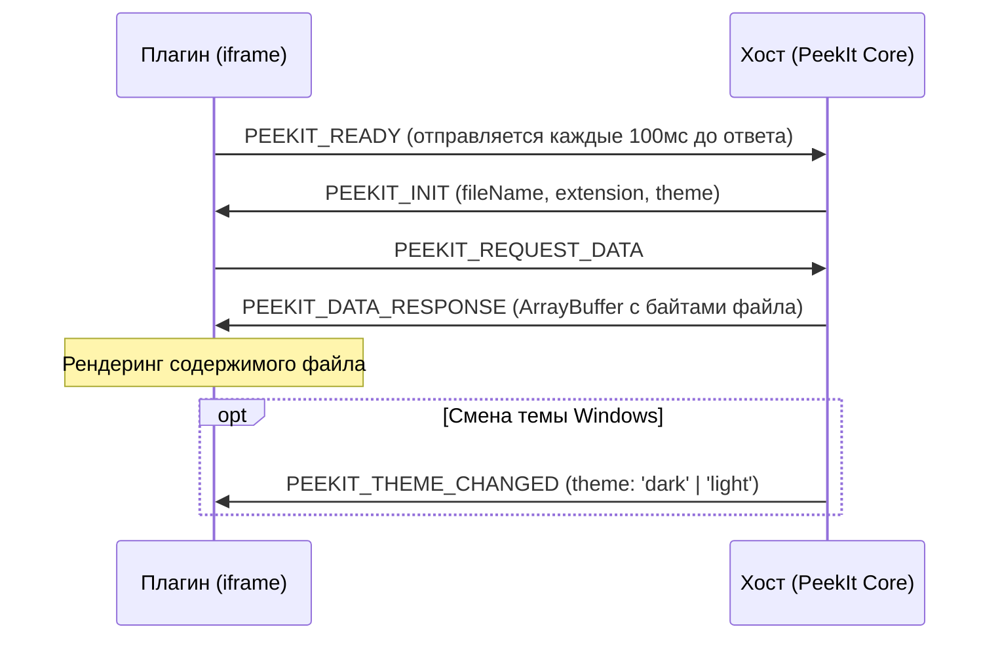

# Руководство по разработке и упаковке плагинов для PeekIt (.pkit)

Это официальное руководство разработчика плагинов для **PeekIt**. Здесь описана полная архитектура веб-плагинов, протокол взаимодействия по IPC, правила оформления манифеста, стандарты безопасности и автоматизация сборки пакетов в формат **`.pkit`**.

---

## 1. Введение и концепция

Плагины в PeekIt — это **автономные веб-приложения (HTML + CSS + JS)**, которые запускаются внутри изолированного sandboxed контейнера WebView2.

### Преимущества такой архитектуры:
1. **Безопасность и стабильность**: Сбой в плагине не приводит к падению программы PeekIt.
2. **Нулевая компиляция**: Разработчикам не нужно ставить Rust, C++ или компиляторы Windows. Достаточно обычного веб-стека.
3. **Любые веб-библиотеки**: Можно использовать Three.js, Canvas, WebGL, WASM, SVG, Audio API, OpenType, SheetJS и любые другие библиотеки.
4. **100% Автономность**: Плагин обязан работать без подключения к сети Интернет.

---

## 2. Анатомия плагина

Каждый плагин представляет собой папку со следующей минимальной структурой:

```text
my-awesome-plugin/
├── manifest.json         # Паспорт плагина (метаданные, расширения, версия)
├── index.html            # Единая точка входа (UI + логика + инлайненные стили и скрипты)
└── icon.svg              # (Опционально) Иконка плагина для магазина/настроек
```

> **Критическое правило (Zero External Requests)**:  
> Плагин **не должен** загружать скрипты или шрифты с внешних CDN (`<script src="https://cdn...">` запрещены!). Все внешние JS-библиотеки должны быть скачаны локально и в идеале инлайнены прямо внутрь `index.html`. Это гарантирует мгновенный запуск и полную независимость от интернета.

---

## 3. Манифест плагина (`manifest.json`)

Файл `manifest.json` описывает для ядра PeekIt, какие типы файлов перехватывать и как отображать плагин.

```json
{
  "$schema": "https://raw.githubusercontent.com/kobaltgit/peekit-plugins/main/plugin-schema.json",
  "id": "com.developer.my-plugin",
  "name": "My Awesome Viewer",
  "version": "1.0.0",
  "author": "Your Name",
  "description": "Мгновенный предпросмотр файлов формата XYZ",
  "extensions": [".xyz", ".abc"],
  "entry": "index.html",
  "default_view": "window",
  "icon": "icon.svg",
  "min_peekit_version": "1.0.0",
  "permissions": []
}
```

### Пояснения к полям:
| Поле | Тип | Описание |
| :--- | :--- | :--- |
| `id` | `string` | Уникальный идентификатор в формате обратного домена (например, `com.peekit.3d-viewer`) |
| `name` | `string` | Человекочитаемое название плагина |
| `version` | `string` | Версия плагина по SemVer (`1.0.0`) |
| `author` | `string` | Имя автора или организации |
| `description` | `string` | Краткое описание функциональности (до 150 символов) |
| `extensions` | `string[]` | Массив расширений файлов, начинающихся с точки (`[".stl", ".obj"]`) |
| `entry` | `string` | Точка входа (всегда `index.html`) |
| `default_view` | `string` | Режим отображения: `"window"` (стандартный вьюпорт) |
| `icon` | `string` | Относительный путь к иконке (SVG) |

---

## 4. Протокол взаимодействия (PeekIt RPC Protocol)

Плагин общается с хост-приложением PeekIt через двусторонние сообщения `window.postMessage`.

### Диаграмма рукопожатия (Handshake):



### Шаблон реализации протокола в `index.html`:

```javascript
(function () {
  let readyInterval = null;

  // 1. Слушаем входящие сообщения от PeekIt
  window.addEventListener('message', async (event) => {
    const msg = event.data;
    if (!msg || typeof msg !== 'object') return;

    switch (msg.type) {
      // Инициализация при открытии окна
      case 'PEEKIT_INIT': {
        if (readyInterval) {
          clearInterval(readyInterval);
          readyInterval = null;
        }

        const { fileName, extension, theme } = msg.payload || {};
        
        // Устанавливаем тему (dark / light)
        if (theme) {
          document.documentElement.setAttribute('data-theme', theme);
        }

        // Запрашиваем бинарные данные выбранного файла
        window.parent.postMessage({ type: 'PEEKIT_REQUEST_DATA' }, '*');
        break;
      }

      // Переключение системной темы на лету
      case 'PEEKIT_THEME_CHANGED': {
        if (msg.payload?.theme) {
          document.documentElement.setAttribute('data-theme', msg.payload.theme);
        }
        break;
      }

      // Получение данных файла
      case 'PEEKIT_DATA_RESPONSE': {
        const rawData = msg.payload?.data !== undefined ? msg.payload.data : msg.payload;
        const error = msg.payload?.error;

        if (error || !rawData) {
          showError('Ошибка чтения файла: ' + (error || 'Нет данных'));
          return;
        }

        // Нормализация в ArrayBuffer
        let buffer = null;
        if (rawData instanceof ArrayBuffer) {
          buffer = rawData;
        } else if (ArrayBuffer.isView(rawData)) {
          buffer = rawData.buffer.slice(rawData.byteOffset, rawData.byteOffset + rawData.byteLength);
        } else if (Array.isArray(rawData)) {
          buffer = new Uint8Array(rawData).buffer;
        }

        // Запуск парсинга и рендеринга
        renderFile(buffer);
        break;
      }
    }
  });

  function showError(text) {
    document.body.innerHTML = `<div class="error-box">${text}</div>`;
    window.parent.postMessage({
      type: 'PEEKIT_ERROR',
      payload: { message: text }
    }, '*');
  }

  // 2. Отправляем сигнал готовности хосту
  readyInterval = setInterval(() => {
    window.parent.postMessage({ type: 'PEEKIT_READY' }, '*');
  }, 100);
  window.parent.postMessage({ type: 'PEEKIT_READY' }, '*');
})();
```

---

## 5. Что такое пакет `.pkit`?

**`.pkit` (PeekIt Plugin Package)** — это официальный дистрибутивный формат плагинов.

- Технически это **стандартный ZIP-архив** с расширением `.pkit`.
- Внутри архива в **корневом каталоге** должны лежать:
  - `manifest.json` (обязательно)
  - `index.html` (обязательно)
  - `icon.svg` (рекомендуется)
  - Любые другие локальные ассеты.

---

## 6. Автоматизация упаковки плагинов

Для автоматической сборки и валидации используется утилита **`pack_plugin.cjs`**.

### Что делает скрипт упаковки:
1. Проверяет наличие `manifest.json` и `index.html`.
2. Валидирует корректность схемы JSON и наличие всех обязательных полей (`id`, `version`, `extensions`).
3. Проверяет, что нет неинлайненных внешних зависимостей.
4. Создает сжатый ZIP-архив и сохраняет его с расширением `.pkit`:
   `dist/<plugin-id>-<version>.pkit`
5. Вычисляет **SHA-256 хэш** файла (нужен для реестра `registry.json` и проверки целостности).

### Запуск упаковки:

```bash
# Упаковать конкретный плагин
node pack_plugin.cjs plugins/peekit-plugin-3d

# Упаковать все плагины сразу
node pack_plugin.cjs --all
```

---

## 7. Чек-лист перед публикацией

Перед тем как отправлять плагин в общий каталог или релиз:
- [ ] Плагин работает без интернета (выключите Wi-Fi и проверьте).
- [ ] Поддерживается тёмная и светлая тема (`[data-theme="dark"]` и `[data-theme="light"]`).
- [ ] Окно адаптивно реагирует на изменение размеров (`window.onresize`).
- [ ] Нажатие Esc или смена фокуса корректно скрывает окно без утечек памяти/таймеров.
- [ ] Название файла и формат отображаются в шапке окна.
- [ ] Собрать пакет `.pkit` и проверить вычисленный SHA-256.
