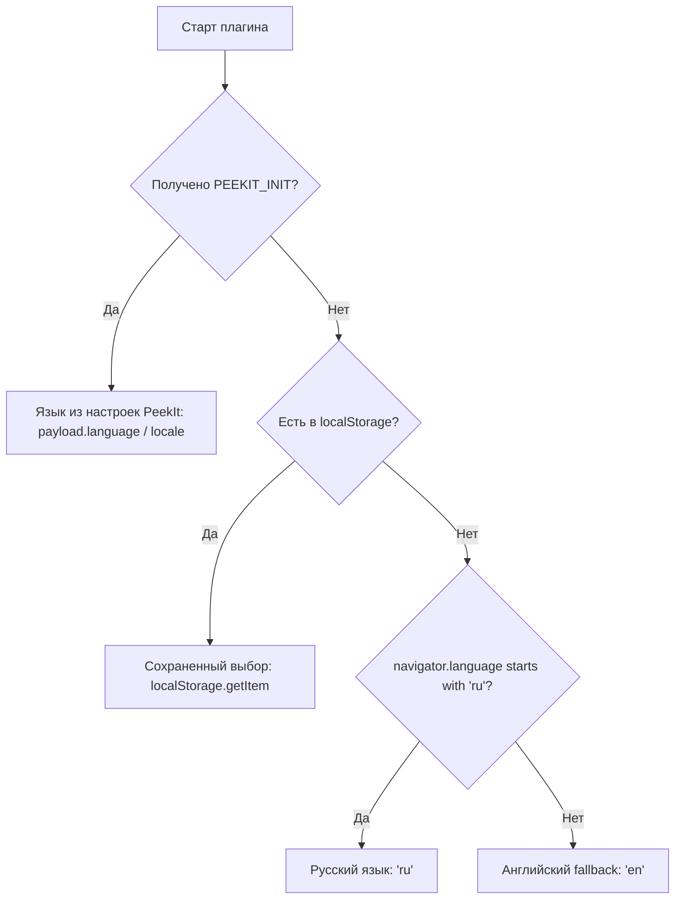

# Руководство по интернационализации плагинов (I18N Guide)

Пользователи **PeekIt** работают как в русскоязычной, так и в англоязычной среде Windows. Поэтому все плагины в официальном каталоге **обязаны поддерживать двуязычный интерфейс (RU / EN)** без исключений.

---

## 1. Каскад приоритетов определения языка

При запуске плагин определяет язык пользователя по следующему каскадному правилу:



> [!IMPORTANT]
> **Каверзное свойство хоста PeekIt:**  
> В конфигурации PeekIt язык может называться как `language`, так и `locale`. При извлечении языка обязательно используйте каскадный оператор:
> ```javascript
> const lang = payload.language || payload.locale || payload.lang || 
>              payload.settings?.language || payload.settings?.locale || currentLocale;
> ```

---

## 2. Структура словаря переводов и хелпер `t()`

Храните строки в компактном монолитном объекте `I18N`:

```javascript
const I18N = {
  ru: {
    loading: 'Загрузка...',
    waiting: 'Ожидание данных от приложения PeekIt',
    error: 'Не удалось прочитать файл',
    zoomIn: 'Приблизить (+)',
    zoomOut: 'Отдалить (-)',
    fit: 'Вписать в окно (Ctrl+0)',
    layers: 'Слои',
    langToggleTitle: 'Сменить язык (EN / RU)'
  },
  en: {
    loading: 'Loading...',
    waiting: 'Waiting for data from PeekIt application',
    error: 'Failed to read file',
    zoomIn: 'Zoom In (+)',
    zoomOut: 'Zoom Out (-)',
    fit: 'Fit to Screen (Ctrl+0)',
    layers: 'Layers',
    langToggleTitle: 'Switch Language (EN / RU)'
  }
};

let currentLocale = (navigator.language && navigator.language.startsWith('ru')) ? 'ru' : 'en';

function t(key) {
  return (I18N[currentLocale] || I18N.en)[key] || key;
}
```

---

## 3. Разметка HTML и декларативная локализация

Для автоматического обновления всех текстов при смене языка используйте `data-*` атрибуты:

### 3.1 Текстовое содержимое (`data-i18n`)
```html
<span id="docTitle" data-i18n="loading">Загрузка...</span>
```

### 3.2 Всплывающие подсказки (`data-i18n-title`)
```html
<button class="btn-icon" id="btnZoomIn" data-i18n-title="zoomIn" title="Приблизить (+)">+</button>
```

### 3.3 Плейсхолдеры поиска (`data-i18n-placeholder`)
```html
<input type="text" id="filterInput" data-i18n-placeholder="searchPlaceholder" placeholder="Поиск...">
```

### 3.4 Изоляция текста в кнопках с иконками
Никогда не помещайте текст и иконку в один текстовый узел. Оборачивайте текст в отдельный `<span>`:
```html
<!-- ПРАВИЛЬНО: -->
<button class="btn" id="btnLayers">
  <span class="btn-icon">▦</span>
  <span id="btnLayersText" data-i18n="layers">Слои</span>
</button>
```

---

## 4. Функция `applyLocale` и двусторонняя синхронизация

```javascript
function applyLocale(locale) {
  if (!locale) return;
  currentLocale = locale.slice(0, 2).toLowerCase();
  if (!I18N[currentLocale]) currentLocale = 'en';

  // Сохраняем в localStorage плагина
  try {
    localStorage.setItem('peekit_plugin_lang', currentLocale);
  } catch (_) {}

  document.documentElement.setAttribute('lang', currentLocale);

  // Обновляем кнопку в шапке
  const btn = document.getElementById('btnToggleLang');
  if (btn) {
    btn.textContent = currentLocale.toUpperCase();
    btn.title = t('langToggleTitle');
  }

  // Обновляем все элементы с декларативными атрибутами
  document.querySelectorAll('[data-i18n]').forEach(el => {
    const k = el.getAttribute('data-i18n');
    if (k && t(k)) el.textContent = t(k);
  });

  document.querySelectorAll('[data-i18n-title]').forEach(el => {
    const k = el.getAttribute('data-i18n-title');
    if (k && t(k)) el.title = t(k);
  });

  document.querySelectorAll('[data-i18n-placeholder]').forEach(el => {
    const k = el.getAttribute('data-i18n-placeholder');
    if (k && t(k)) el.placeholder = t(k);
  });

  // Если контент уже отрисован, перерисовываем динамические бейджи/счетчики
  if (typeof updateDynamicBadges === 'function') {
    updateDynamicBadges();
  }
}

// Клик по кнопке в шапке переключает язык и уведомляет хост
document.getElementById('btnToggleLang').addEventListener('click', () => {
  const nextLocale = currentLocale === 'ru' ? 'en' : 'ru';
  applyLocale(nextLocale);

  // Двусторонний IPC: уведомляем хост PeekIt
  if (window.parent && window.parent !== window) {
    window.parent.postMessage({
      type: 'PEEKIT_LANGUAGE_CHANGED',
      payload: { language: nextLocale, locale: nextLocale }
    }, '*');
  }
});
```

---

## 5. Предотвращение мигания текста (Zero-Flash Rule)

> [!CAUTION]
> **ОБЯЗАТЕЛЬНОЕ ПРАВИЛО:**  
> Всегда вызывайте `applyLocale(currentLocale)` **синхронно при первой загрузке скрипта** (до прихода каких-либо IPC-сообщений).  
> Если этого не сделать, на медленных машинах окно предпросмотра на долю секунды покажет дефолтный текст на одном языке, а затем резко перерисуется на другой.

---

## 6. Как автоматический тест проверяет полноту локализации

Тестовый раннер `npm test` выполняет строгую проверку:
1. Запоминает все элементы, у которых в исходном HTML был русский текст.
2. Эмулирует переключение языка на английский (`payload: { language: 'en' }`).
3. Сканирует свойства `textContent`, `title` и `placeholder` запомненных элементов.
4. **Если в английском режиме обнаруживается хотя бы один символ кириллицы (`/[а-яё]/i`), тест завершается ошибкой `FAIL: I18N check failed`.**

Убедитесь, что все динамические надписи (например, `"12 слоёв"`, `"0.0 КБ"`, `"Страница 1 из 10"`) в английском режиме выводятся как `"12 layers"`, `"0.0 KB"`, `"Page 1 of 10"`.
