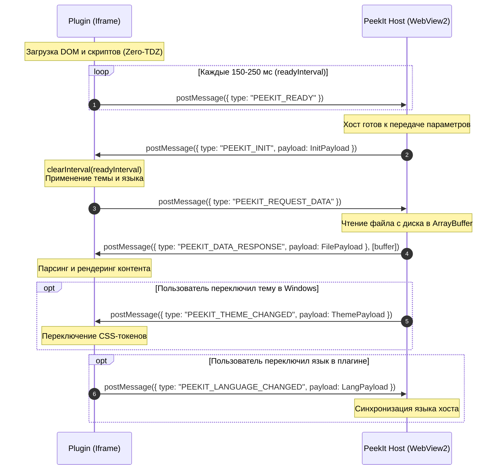

# PeekIt Plugin IPC / RPC Specification

Версия протокола: `1.4`  
Изоляция: `<iframe sandbox="allow-scripts">`  
Транспорт: `window.postMessage` (Двусторонний асинхронный канал с поддержкой Transferable Objects)

---

## 1. Архитектурные принципы

Плагины PeekIt выполняются в строгой изолированной песочнице Microsoft Edge WebView2.
Прямой доступ к диску, реестру Windows, сети и системным API для плагина заблокирован. Все взаимодействие с файлами и средой приложения происходит исключительно через протокол сообщений `window.postMessage`.

### Формат сообщения

Все сообщения между хост-приложением PeekIt и плагином представляют собой сериализуемые JavaScript-объекты со следующей сигнатурой:

```typescript
interface PeekItMessage<T = unknown> {
  type: string;        // Идентификатор события (например, "PEEKIT_INIT")
  payload?: T;         // Полезная нагрузка события
  error?: string;      // Сообщение об ошибке (если применимо)
}
```

---

## 2. Диаграмма жизненного цикла и рукопожатия

Из-за асинхронной загрузки iframe и хоста момент готовности сторон не детерминирован. Поэтому протокол использует надёжный цикл рукопожатия с периодическим оповещением о готовности:



> [!CAUTION]
> **КРИТИЧЕСКИЙ АНТИПАТТЕРН (Бесконечный цикл):**  
> **Никогда не отправляйте `PEEKIT_READY` в ответ на получение `PEEKIT_DATA_RESPONSE`!**  
> Хост PeekIt интерпретирует `PEEKIT_READY` как признак перезагрузки iframe и повторно отправляет `PEEKIT_INIT`. Это приводит к бесконечной перезагрузке данных, дерганию интерфейса и утечкам памяти.

---

## 3. Сообщения: Плагин ➔ Хост (Outbound)

Для отправки сообщения хост-приложению плагин вызывает:
```javascript
window.parent.postMessage({ type: 'EVENT_NAME', payload: { ... } }, '*');
```

### 3.1 `PEEKIT_READY`
Сигнал хосту о том, что DOM плагина сформирован и слушатель сообщений зарегистрирован.
* **Периодичность:** Отправляется интервалом (150–250 мс) до первого ответа `PEEKIT_INIT`.
* **Payload:** не требуется.

```javascript
let readyInterval = setInterval(() => {
  window.parent.postMessage({ type: 'PEEKIT_READY' }, '*');
}, 200);
```

### 3.2 `PEEKIT_REQUEST_DATA`
Запрос содержимого открытого файла. Отправляется строго после получения `PEEKIT_INIT`.
* **Payload:** не требуется.

```javascript
window.parent.postMessage({ type: 'PEEKIT_REQUEST_DATA' }, '*');
```

### 3.3 `PEEKIT_LANGUAGE_CHANGED`
Уведомление хоста о ручном переключении языка пользователем через кнопку в интерфейсе плагина (двусторонняя синхронизация).

```javascript
window.parent.postMessage({
  type: 'PEEKIT_LANGUAGE_CHANGED',
  payload: { language: 'en', locale: 'en' }
}, '*');
```

### 3.4 `SET_TITLE`
Установка дополнительной информации в заголовок окна PeekIt (разрешение, число страниц, имя подфайла).

```javascript
window.parent.postMessage({
  type: 'SET_TITLE',
  payload: { title: 'Схема.svg (1920×1080)' }
}, '*');
```

### 3.5 `PEEKIT_ERROR` (или `ERROR`)
Оповещение хоста о критической ошибке парсинга файла.

```javascript
window.parent.postMessage({
  type: 'PEEKIT_ERROR',
  payload: { message: 'Файл поврежден или содержит неподдерживаемый формат данных' }
}, '*');
```

---

## 4. Сообщения: Хост ➔ Плагин (Inbound)

### 4.1 `PEEKIT_INIT`
Отправляется хостом в ответ на `PEEKIT_READY`. Передаёт конфигурацию среды.

```typescript
interface InitPayload {
  theme?: "dark" | "light" | "system";
  isDark?: boolean;
  accentColor?: string;     // Например, "#0078D4"
  language?: "ru" | "en";
  locale?: "ru" | "en";
  version?: string;         // Версия PeekIt (например, "1.4.0")
  filePath?: string;        // Полный путь к открываемому файлу
}
```

### 4.2 `PEEKIT_DATA_RESPONSE`
Передача содержимого файла в плагин. Для бинарных файлов хост передает `ArrayBuffer` через механизм Transferable Objects (zero-copy).

```typescript
interface FileDataPayload {
  name: string;             // Имя файла ("model.stl")
  path: string;             // Полный путь на диске
  size: number;             // Размер в байтах
  mimeType: string;         // MIME-тип (например, "image/svg+xml")
  // Бинарные данные или текстовая строка:
  data: ArrayBuffer | Uint8Array | string;
  // Для обратной совместимости дублируется в поле content:
  content?: ArrayBuffer | string;
  error?: string | null;    // Ошибка чтения файла (если возникла на уровне хоста)
}
```

### 4.3 `PEEKIT_THEME_CHANGED`
Отправляется хостом при смене системной темы Windows на лету.

```typescript
interface ThemePayload {
  theme: "dark" | "light" | "system";
  isDark: boolean;
  accentColor?: string;
}
```

### 4.4 `PEEKIT_LANGUAGE_CHANGED` (или `PEEKIT_LOCALE_CHANGED`)
Отправляется хостом при смене языка в глобальных настройках PeekIt.

```typescript
interface LanguagePayload {
  language: "ru" | "en";
  locale: "ru" | "en";
}
```

---

## 5. Канонический обработчик сообщений (Zero-TDZ)

Ниже приведён эталонный код обработчика, обеспечивающий устойчивость к ошибкам инициализации:

```javascript
// 1. Состояние
let readyInterval = null;
let currentLocale = 'ru';
let isDarkTheme = true;

// 2. Слушатель сообщений
window.addEventListener('message', (event) => {
  const msg = event.data;
  if (!msg || typeof msg !== 'object') return;

  switch (msg.type) {
    case 'PEEKIT_INIT': {
      // Обязательно гасим интервал рукопожатия!
      if (readyInterval) {
        clearInterval(readyInterval);
        readyInterval = null;
      }

      const p = msg.payload || {};

      // Определение языка (каскад)
      const lang = p.language || p.locale || 'ru';
      applyLocale(lang);

      // Определение темы
      applyTheme(p.isDark !== undefined ? p.isDark : p.theme !== 'light');

      // Запрашиваем данные файла
      window.parent.postMessage({ type: 'PEEKIT_REQUEST_DATA' }, '*');
      break;
    }

    case 'PEEKIT_DATA_RESPONSE': {
      const p = msg.payload || {};
      if (p.error) {
        showError(p.error);
        return;
      }
      renderFile(p.data || p.content, p);
      break;
    }

    case 'PEEKIT_THEME_CHANGED': {
      const p = msg.payload || {};
      applyTheme(p.isDark !== undefined ? p.isDark : p.theme !== 'light');
      break;
    }

    case 'PEEKIT_LANGUAGE_CHANGED':
    case 'PEEKIT_LOCALE_CHANGED': {
      const p = msg.payload || {};
      applyLocale(p.language || p.locale);
      break;
    }
  }
});

// 3. Старт рукопожатия
readyInterval = setInterval(() => {
  window.parent.postMessage({ type: 'PEEKIT_READY' }, '*');
}, 200);
```
